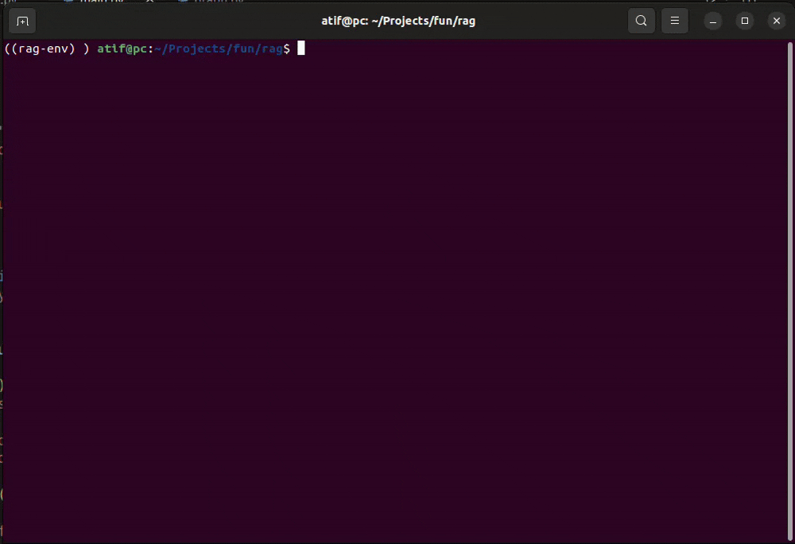

# RAG Assistant

A simple Retrieval-Augmented Generation (RAG) assistant that indexes your PDF files into a ChromaDB vector store and queries them using a local LLM via Ollama.

This RAG system uses two simple agents:

A Router Agent that checks if the user query matches the vector database.

An Answer Agent that either uses RAG retrieval when a match is found or sends the query directly to the LLM when no relevant data exists.

---

# Flow diagram
										   ┌───────────────────────────────┐
										   │          User Question         │
										   │      (e.g., "What is a SoC?")  │
										   └───────────────┬───────────────┘
														   │
														   ▼
									 ┌────────────────────────────────────────────┐
									 │   Step 1: Search Document Library          │
									 │   (Check Vector Database for a Match)      │
									 └───────────────────────┬────────────────────┘
															 │
												  ┌──────────┴───────────┐
												  │                      │
												  ▼                      ▼
									┌───────────────────────┐   ┌───────────────────────────┐
									│    Step 2A: RAG       │   │    Step 2B: Direct LLM     │
									│ (Answer from your     │   │ (General LLM knowledge —   │
									│   uploaded SoC docs)  │   │  used when no match found) │
									└─────────────┬─────────┘   └────────────┬──────────────┘
												  │                          │
												  ▼                          ▼
								 ┌──────────────────────────────┐   ┌──────────────────────────────┐
								 │ Assistant responds with      │   │ Assistant responds with     │
								 │ answer + citations (sources) │   │ general answer (no sources)  │
								 └──────────────────────────────┘   └──────────────────────────────┘


## 1. Add your data

Put your PDF files into the `data/` folder:

```bash
mkdir -p data
# copy your PDFs into this folder
cp /path/to/your/file.pdf data/
```

## 2. Install dependencies:
```bash
pip install -r requirements.txt
```
	
## 3. ingest docs into Chroma DB:
```bash
python -m app.ingest
```

## 4. Install Ollama
```bash
sudo snap install Ollam
	
# pull the model

ollama pull llama3
```

## 5. Run the assistant:
```bash
python -m app.main 
```

## Demo

<p align="center">
	
</p>

